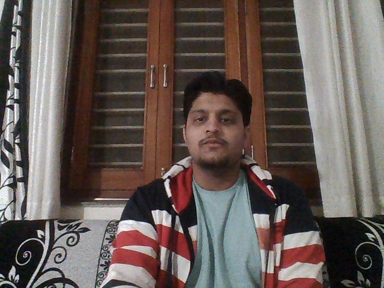

This folder contains all the code snippets from the chapter 3 of the book. 

### Applying filters to image:
_______________________________________________________________________________________________________________________________

**Original Image **

**Sharp Filter **                                       **Blur Filter**

   
   

  
   

