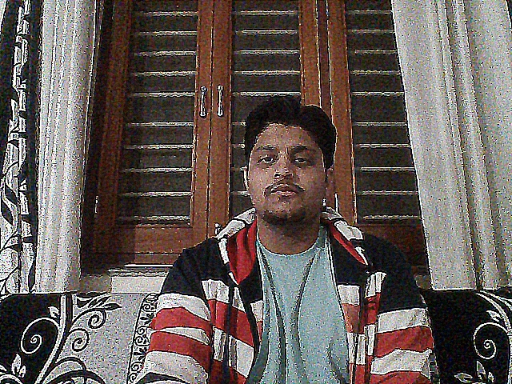
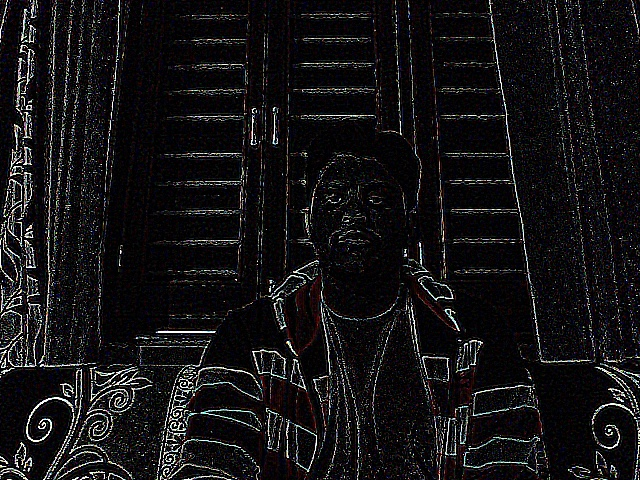

This folder contains all the code snippets from the chapter 3 of the book. 

### Applying filters to image:
_______________________________________________________________________________________________________________________________

 

  
   

